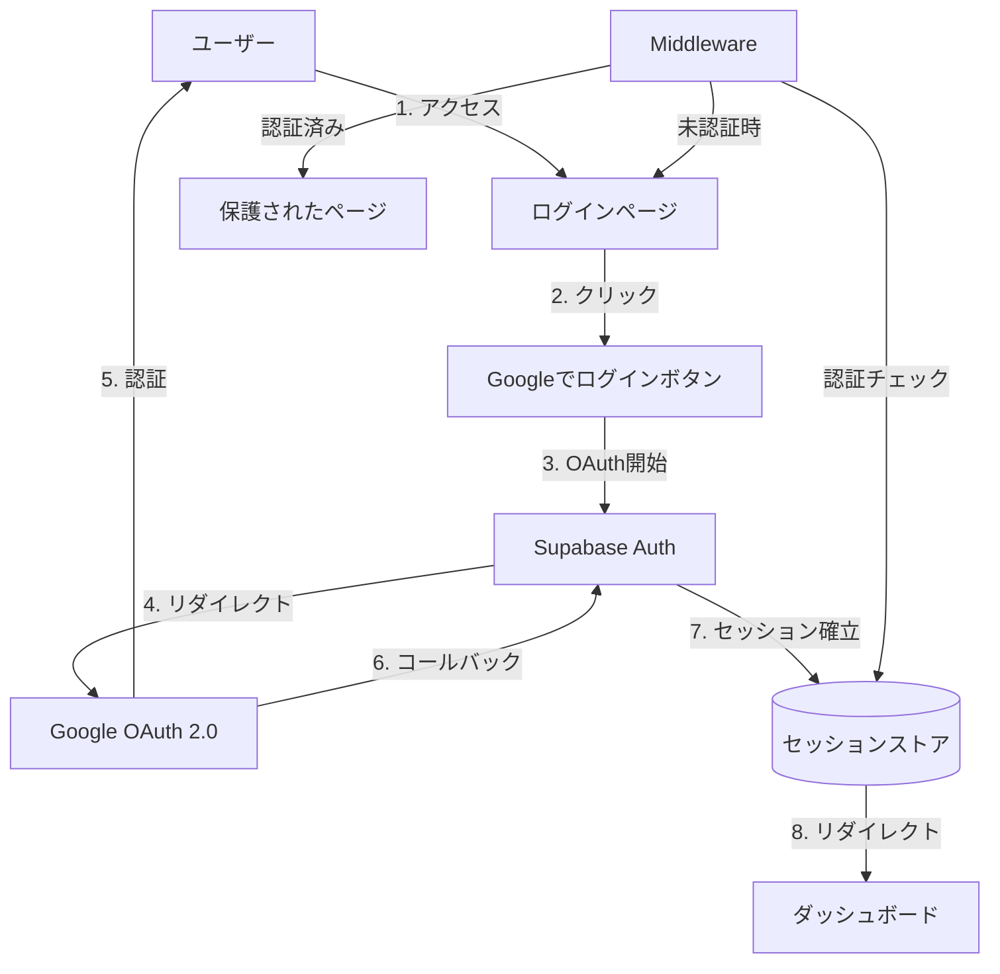
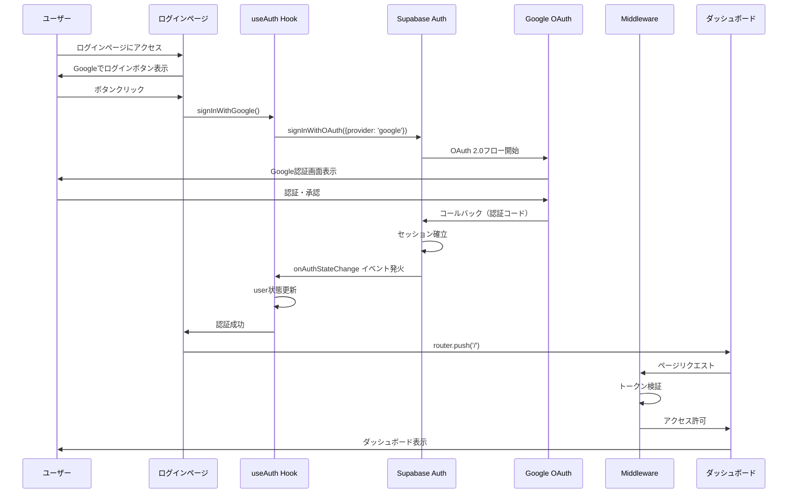
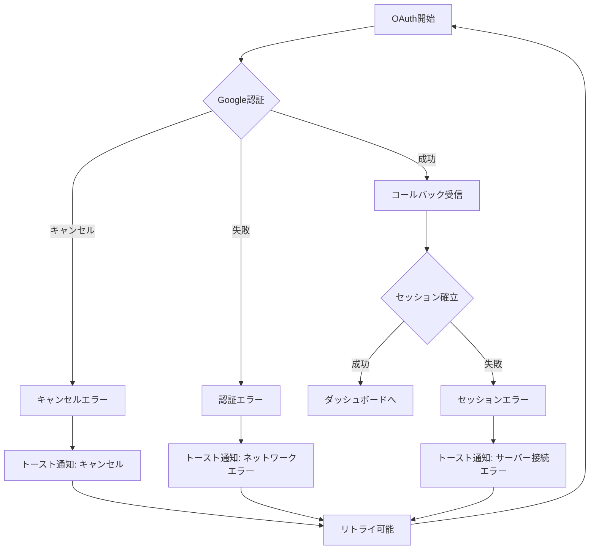

# Google OAuth認証への移行 - 技術設計ドキュメント

## 概要

本機能は、LinkLoomの認証方式を現在のEmail/パスワード認証からGoogle OAuth 2.0認証に置き換える。ユーザーはGoogleアカウントでシームレスにログインでき、パスワード管理の負担が軽減される。Supabase Auth Google Providerを活用し、既存の認証インフラストラクチャを最大限に再利用しながら、Google OAuth専用のUIと認証フローを実装する。

**ユーザー**: 個人開発者および将来的な小規模チーム（10人以下）が技術記事管理のために利用する。

**影響**: 現在のEmail/パスワード認証システムをGoogle OAuth 2.0に完全に置き換え、`LoginForm`コンポーネント、`SignupForm`コンポーネント、および関連する認証フローを削除する。既存の`useAuth`フック、`supabase`クライアント、`middleware.ts`は拡張して再利用する。

### ゴール

- Googleアカウントでのワンクリックログインを実現
- 既存の認証インフラ（`useAuth`、`middleware.ts`、Supabaseクライアント）を最大限再利用
- Email/パスワード認証コードを完全に削除
- セキュアで信頼性の高いOAuth 2.0フローを実装
- 複数デバイス間でのセッション同期を維持

### 非ゴール

- Email/パスワード認証との併用（Google OAuth専用に統一）
- 複数OAuthプロバイダーのサポート（将来的な拡張として検討）
- カスタム認証画面のブランディング（Phase 1では標準的なUI）
- ソーシャルログインの追加（Twitter、GitHub等）

---

## アーキテクチャ

### 既存アーキテクチャ分析

**現在の認証システム**:
- **Supabaseクライアント** (`src/lib/supabase.ts`): 既に設定済み、OAuth対応可能
- **useAuthフック** (`src/hooks/useAuth.ts`): 認証状態管理とAPI呼び出し
- **Middleware** (`src/middleware.ts`): ページ保護とリダイレクト制御
- **LoginForm/SignupForm**: Email/パスワード認証用UI（削除対象）

**再利用する既存コンポーネント**:
- `supabase`クライアント: OAuth設定追加のみで再利用
- `useAuth`フック: `signInWithGoogle()`メソッドを追加
- `middleware.ts`: パブリックページリストを更新して再利用
- 認証状態監視ロジック: そのまま再利用

**削除する既存コンポーネント**:
- `src/components/auth/LoginForm.tsx`
- `src/components/auth/SignupForm.tsx`
- `src/app/signup/page.tsx`（サインアップページ全体）

### 高レベルアーキテクチャ



**アーキテクチャ統合**:
- **保持された既存パターン**: Supabase Auth統合、クライアントサイド状態管理（`useAuth`）、Middlewareによるページ保護
- **新規コンポーネントの根拠**: `GoogleLoginButton`（OAuth専用UI）、`signInWithGoogle()`（OAuth API呼び出し）
- **技術整合性**: 既存のNext.js App Router、Supabase Auth、TypeScript型システムと完全に統合
- **Steering準拠**: `tech.md`のSupabase Auth戦略、`structure.md`のコンポーネント配置規則を維持

### 技術整合性

**既存技術スタックとの整合**:
- **Next.js 15 App Router**: Server ComponentsとClient Componentsの混在パターンを継続
- **Supabase Auth**: 既存の`supabase`クライアント設定を拡張してOAuth対応
- **TypeScript**: 既存の型定義（`User`, `Session`, `AuthError`）をそのまま利用
- **React Hook Form + Zod**: Email認証フォームからは削除、エラーハンドリングのみ継続
- **shadcn/ui**: `Button`コンポーネントを使用してGoogleログインボタンを実装

**新規依存関係**:
なし（既存のSupabase JS SDKがOAuth機能を含む）

---

## システムフロー

### Google OAuth認証フロー



### エラーハンドリングフロー



---

## コンポーネントとインターフェース

### 認証レイヤー

#### useAuth Hook (拡張)

**責任と境界**

- **主要責任**: アプリ全体の認証状態管理とSupabase Auth API呼び出し
- **ドメイン境界**: 認証ドメイン全体（OAuth、セッション管理、状態監視）
- **データ所有権**: ユーザー情報（`user`）、セッション状態（`loading`）
- **トランザクション境界**: Supabase Authとの通信単位

**依存関係**

- **インバウンド**: `LoginPage`、`Header`、保護されたページコンポーネント
- **アウトバウンド**: `supabase`クライアント（Supabase Auth API）
- **外部**: Supabase Auth（`@supabase/supabase-js`）

**外部依存関係調査**:

Supabase Auth Google OAuth実装:
- **APIメソッド**: `supabase.auth.signInWithOAuth({ provider: 'google', options: { redirectTo } })`
- **認証フロー**: PKCE (Proof Key for Code Exchange) 対応のOAuth 2.0
- **セッション管理**: JWTトークン（access_token、refresh_token）をクッキーに自動保存
- **イベント監視**: `onAuthStateChange`でセッション変更をリアルタイム検知
- **リダイレクト**: `redirectTo`オプションで認証後のリダイレクト先を指定
- **エラーハンドリング**: `AuthError`型でエラー詳細を取得

**サービスインターフェース**:

```typescript
interface UseAuthReturn {
  user: User | null
  session: Session | null  // 追加
  loading: boolean
  signInWithGoogle: () => Promise<{ error: AuthError | null }>  // 新規
  signOut: () => Promise<{ error: AuthError | null }>
}
```

**事前条件**:
- Supabaseクライアントが初期化されていること
- Google OAuth Providerが有効化されていること
- 環境変数（`NEXT_PUBLIC_SUPABASE_URL`、`NEXT_PUBLIC_SUPABASE_ANON_KEY`）が設定されていること

**事後条件**:
- `signInWithGoogle()`正常実行後、ユーザーはGoogle OAuth画面にリダイレクトされる
- 認証成功後、`user`状態が更新され、セッションが確立される
- `signOut()`正常実行後、`user`は`null`になり、セッションが破棄される

**不変条件**:
- `loading`が`false`の場合、`user`は常に最新の認証状態を反映する
- セッション変更時、`onAuthStateChange`イベントが必ず発火する

**変更点**:
- **追加**: `signInWithGoogle()`メソッド
- **追加**: `session`プロパティ（要件で必要とされたため）
- **削除**: `signIn(email, password)`メソッド
- **削除**: `signUp(email, password)`メソッド

---

#### GoogleLoginButton Component (新規)

**責任と境界**

- **主要責任**: Google OAuth認証を開始するUIボタンの提供
- **ドメイン境界**: 認証UI層
- **データ所有権**: ローカルUIstate（ローディング、エラー）
- **トランザクション境界**: ボタンクリック → OAuth開始の単一トランザクション

**依存関係**

- **インバウンド**: `LoginPage`
- **アウトバウンド**: `useAuth`フック
- **外部**: shadcn/ui `Button`コンポーネント、`sonner`トースト

**コントラクト定義**:

```typescript
interface GoogleLoginButtonProps {
  onSuccess?: () => void  // 認証成功時のコールバック（オプション）
  onError?: (error: AuthError) => void  // エラー時のコールバック（オプション）
}
```

**事前条件**:
- `useAuth`フックが利用可能であること

**事後条件**:
- クリック時に`signInWithGoogle()`が呼び出される
- ローディング中はボタンが無効化される
- エラー時にトースト通知が表示される

---

#### LoginPage (置き換え)

**責任と境界**

- **主要責任**: Google OAuth認証のエントリーポイントUI提供
- **ドメイン境界**: 認証UI層
- **データ所有権**: なし（ステートレス）
- **トランザクション境界**: ページレンダリング単位

**依存関係**

- **インバウンド**: ユーザーアクセス、Middlewareリダイレクト
- **アウトバウンド**: `GoogleLoginButton`
- **外部**: Next.js `useRouter`

**変更点**:
- `LoginForm`コンポーネントを削除
- `GoogleLoginButton`コンポーネントに置き換え
- レイアウトをシンプルなセンタリング配置に変更

---

### インフラストラクチャレイヤー

#### Supabase Client (設定拡張)

**責任と境界**

- **主要責任**: Supabase APIへの接続とOAuth設定管理
- **ドメイン境界**: インフラストラクチャ層
- **データ所有権**: 接続設定、クライアントインスタンス
- **トランザクション境界**: API呼び出し単位

**依存関係**

- **インバウンド**: `useAuth`、すべての認証関連コンポーネント
- **アウトバウンド**: Supabase Auth API
- **外部**: `@supabase/supabase-js`

**設定変更**:

```typescript
export const supabase = createClient<Database>(supabaseUrl, supabaseAnonKey, {
  auth: {
    persistSession: true,
    autoRefreshToken: true,
    detectSessionInUrl: true,  // OAuth コールバック検出に必須
    flowType: 'pkce',  // セキュアなPKCEフロー（推奨）
  },
})
```

**変更点**:
- `flowType: 'pkce'`を明示的に追加（セキュリティ強化）
- その他の設定は既存のまま維持

---

#### Middleware (拡張)

**責任と境界**

- **主要責任**: ページ保護と認証済み/未認証時のリダイレクト制御
- **ドメイン境界**: ルーティング層
- **データ所有権**: リダイレクトロジック
- **トランザクション境界**: HTTPリクエスト単位

**依存関係**

- **インバウンド**: すべてのページリクエスト
- **アウトバウンド**: Next.js `NextResponse`
- **外部**: Next.js Middleware API

**変更点**:

```typescript
const publicRoutes = ['/login', '/']  // '/signup'を削除
```

- `/signup`をパブリックルートから削除（サインアップページを廃止）
- `/`をパブリックルートに追加（ランディングページとして機能）
- トークン検証ロジックは既存のまま維持

---

## データモデル

### ドメインモデル

**認証ドメイン**:

- **User エンティティ**: Supabase `auth.users`テーブルで管理（変更なし）
  - `id`: UUID（主キー）
  - `email`: Googleアカウントのメールアドレス
  - `user_metadata`: Googleプロフィール情報（`full_name`, `avatar_url`）
  - `created_at`: ユーザー作成日時
  - `last_sign_in_at`: 最終ログイン日時

- **Session 値オブジェクト**: Supabase管理のセッション情報
  - `access_token`: JWT アクセストークン
  - `refresh_token`: リフレッシュトークン
  - `expires_at`: セッション有効期限（Unix timestamp）
  - `user`: 関連するUserエンティティ

**ビジネスルールと不変条件**:
- ユーザーは一意の`email`を持つ
- セッションは1週間（Supabaseデフォルト）で有効期限切れ
- リフレッシュトークンによる自動セッション更新
- 複数デバイス間でセッションは独立して管理される

### データベース影響

**変更なし**:
- `auth.users`テーブル: Supabase管理、スキーマ変更なし
- `articles`テーブル: `user_id`外部キーは`auth.users.id`を参照し続ける

**Google OAuth ユーザーの追加動作**:
- Googleアカウントで初回ログイン時、`auth.users`に新規レコードが自動作成される
- `email`列にGoogleアカウントのemailが保存される
- `user_metadata`に`full_name`と`avatar_url`が自動保存される

---

## エラー処理

### エラー戦略

**レイヤー別エラーハンドリング**:
- **UI層**: トースト通知（`sonner`）でユーザーフレンドリーなメッセージ表示
- **ビジネスロジック層**: `AuthError`型で構造化されたエラー情報を返す
- **インフラ層**: Supabase Auth APIエラーをキャッチして`AuthError`に変換

### エラーカテゴリとレスポンス

**ユーザーエラー**:

| エラータイプ | 検出場所 | エラーメッセージ | リカバリ戦略 |
|------------|--------|----------------|-------------|
| Google認証キャンセル | `signInWithGoogle()` | 「ログインがキャンセルされました」 | リトライ可能、ログインページに留まる |
| 権限拒否 | Google OAuth | 「Googleアカウントへのアクセスが拒否されました」 | 権限許可の説明表示 |

**システムエラー**:

| エラータイプ | 検出場所 | エラーメッセージ | リカバリ戦略 |
|------------|--------|----------------|-------------|
| ネットワークエラー | `signInWithGoogle()` | 「ネットワークエラーが発生しました。もう一度お試しください」 | リトライボタン表示 |
| Supabase接続エラー | Supabase Auth | 「サーバーに接続できませんでした」 | リトライ + 技術サポート連絡先 |
| セッション期限切れ | Middleware | 自動的に`/login`へリダイレクト | ユーザーに通知なし、再ログイン |

**ビジネスロジックエラー**:

| エラータイプ | 検出場所 | エラーメッセージ | リカバリ戦略 |
|------------|--------|----------------|-------------|
| 無効なリダイレクトURL | Supabase Auth | 「設定エラーが発生しました。管理者に連絡してください」 | 開発者側で`redirectTo`設定を修正 |

### モニタリング

**エラートラッキング**:
- コンソールログ出力（開発環境のみ）
- `AuthError`型のプロパティ（`message`, `status`, `name`）を記録
- 本番環境ではユーザーフレンドリーなメッセージのみ表示

**ログ記録**:
```typescript
// 開発環境と本番環境の両方でloggerを使用
import { logger } from '@/lib/logger'

// エラーログ（本番環境でも出力される）
logger.error('[Auth Error]', error.name, error.message, error.status)

// 本番環境ではユーザーフレンドリーなメッセージのみ表示
toast.error('ネットワークエラーが発生しました。もう一度お試しください')
```

**ヘルスモニタリング**:
- Supabase Auth APIの応答時間監視（将来的な拡張）
- 認証成功/失敗率の追跡（将来的な拡張）

---

## テスト戦略

### ユニットテスト (Vitest)

**useAuth Hook**:
- `signInWithGoogle()`呼び出し時、`supabase.auth.signInWithOAuth()`が正しいパラメータで実行される
- `signOut()`呼び出し時、`supabase.auth.signOut()`が実行され、`user`が`null`になる
- `onAuthStateChange`イベント発火時、`user`状態が正しく更新される
- `loading`状態が初期化時`true`、セッション確認後`false`になる

**GoogleLoginButton Component**:
- クリック時に`signInWithGoogle()`が呼び出される
- ローディング中にボタンが無効化される
- エラー時にトースト通知が表示される
- `onSuccess`コールバックが認証成功時に実行される

### 統合テスト (Vitest)

**認証フロー統合**:
- `useAuth` + `GoogleLoginButton`の連携動作
- エラー発生時のトースト表示とリトライ動作
- セッション確立後の状態更新とリダイレクト

**Middleware統合**:
- 未認証ユーザーが保護されたページにアクセス → `/login`へリダイレクト
- 認証済みユーザーが`/login`にアクセス → `/`へリダイレクト
- パブリックページ（`/`）へのアクセスは認証状態に関わらず許可

### E2Eテスト (Playwright)

**ログインフロー**:
- ログインページ表示 → 「Googleでログイン」ボタンが表示される
- ボタンクリック → Google OAuth URLへリダイレクト確認（実際の認証はモック）
- モック認証成功 → ダッシュボード（`/`）へリダイレクト確認

**保護されたページアクセス**:
- 未認証状態で`/articles`にアクセス → `/login`へリダイレクト
- 認証後に元のページ（`/articles`）へリダイレクト確認

**ログアウトフロー**:
- ヘッダーのログアウトボタンクリック → セッション破棄
- `/login`へリダイレクト確認
- 再度保護されたページにアクセス → `/login`へリダイレクト

---

## セキュリティ考慮事項

### 脅威モデリング

**脅威**: CSRF攻撃（Cross-Site Request Forgery）
- **対策**: Supabase Auth標準実装のCSRF保護（state パラメータ検証）
- **実装**: 自動的に処理、追加実装不要

**脅威**: セッションハイジャック
- **対策**: HTTPS通信必須（Vercel自動対応）、HttpOnly クッキー使用
- **実装**: Supabase Authが自動的にHttpOnlyクッキーを使用

**脅威**: トークン漏洩
- **対策**: PKCE (Proof Key for Code Exchange) フロー使用
- **実装**: `flowType: 'pkce'`をSupabaseクライアント設定に追加

### セキュリティ制御

**認証と認可**:
- OAuth 2.0標準準拠の認証フロー
- JWTトークンによるステートレス認証
- Row Level Security (RLS) によるデータアクセス制御（既存）

**データ保護**:
- セッション情報はHttpOnlyクッキーに保存（XSS対策）
- トークンはクライアントサイドJavaScriptからアクセス不可
- リフレッシュトークンによる自動トークン更新

### コンプライアンス要件

**GDPR準拠**:
- Google OAuthスコープは最小限（`email`, `profile`, `openid`のみ）
- ユーザーデータはSupabase管理下で暗号化保存
- ユーザー削除機能は既存のSupabase機能で対応

---

## パフォーマンスとスケーラビリティ

### ターゲットメトリクス

| メトリクス | 目標値 | 測定方法 |
|----------|--------|---------|
| ログインボタンクリック → Google OAuth画面表示 | < 500ms | Chrome DevTools Network タブ |
| Google認証完了 → ダッシュボード表示 | < 1秒 | Lighthouse Performance スコア |
| ページリロード時のセッション復元 | < 300ms | `useAuth`フック初期化時間 |

### 最適化技術

**Supabaseクライアントのシングルトン化**:
- `src/lib/supabase.ts`で単一インスタンスを作成・エクスポート
- 重複インスタンス作成を防ぎ、メモリ使用量を削減

**セッション情報のクライアントキャッシュ**:
- `useAuth`フックで`user`状態をReact stateでキャッシュ
- `onAuthStateChange`イベントでのみ更新、不要なAPI呼び出しを削減

**Server Componentsでのセッション事前取得**:
- 保護されたページでは`getSession()`をサーバーサイドで実行
- クライアントサイドのローディング時間を削減

**ローディング状態の適切な表示**:
- `loading`状態をUIに反映し、ユーザー体験を向上
- スケルトンローディングまたはスピナー表示

---

## 移行戦略

### 移行フェーズ

```mermaid
flowchart TD
    Start[開始] --> Phase1[Phase 1: Google OAuth実装]
    Phase1 --> Phase2[Phase 2: Email認証削除]
    Phase2 --> Phase3[Phase 3: 検証とデプロイ]

    Phase1 --> Task1_1[GoogleLoginButton実装]
    Phase1 --> Task1_2[useAuth拡張]
    Phase1 --> Task1_3[LoginPage置き換え]

    Phase2 --> Task2_1[LoginForm削除]
    Phase2 --> Task2_2[SignupForm削除]
    Phase2 --> Task2_3[/signup削除]
    Phase2 --> Task2_4[Middleware更新]

    Phase3 --> Task3_1[E2Eテスト実行]
    Phase3 --> Task3_2[Lint/TypeCheck]
    Phase3 --> Task3_3[本番デプロイ]

    Task3_3 --> End[完了]

    Phase1 -.->|ロールバック可能| Start
    Phase2 -.->|ロールバック可能| Phase1
    Phase3 -.->|ロールバック可能| Phase2
```

### フェーズ詳細

**Phase 1: Google OAuth実装**:
- `GoogleLoginButton`コンポーネント作成
- `useAuth`フックに`signInWithGoogle()`追加
- `LoginPage`をGoogle OAuth専用UIに置き換え
- **検証チェックポイント**: Google OAuthでログイン可能か確認

**Phase 2: Email認証削除**:
- `LoginForm`コンポーネント削除
- `SignupForm`コンポーネント削除
- `/signup`ページ削除
- `Middleware`のパブリックルート更新
- **検証チェックポイント**: Email認証関連コードが完全に削除されたか確認

**Phase 3: 検証とデプロイ**:
- E2Eテスト実行（ログイン、ログアウト、ページ保護）
- `npm run lint`および`npm run tsc`エラーゼロ確認
- Vercelプレビューデプロイで動作確認
- 本番環境デプロイ
- **検証チェックポイント**: すべてのテストがパスし、本番環境で正常動作するか確認

### ロールバックトリガー

**Phase 1 ロールバック条件**:
- Google OAuth認証が正常に機能しない
- Supabase Auth設定エラーが発生

**Phase 2 ロールバック条件**:
- Email認証削除後、予期しないエラーが発生
- ユーザーからのクリティカルなフィードバック

**Phase 3 ロールバック条件**:
- E2Eテストが失敗
- 本番環境で認証エラーが多発

**ロールバック手順**:
1. Gitブランチを前のPhaseにリバート
2. Vercelで前のデプロイメントにロールバック
3. Supabase設定を元に戻す（必要な場合）

---

**最終更新**: 2025-10-13
**設計レビュー**: ✅ 承認済み・実装完了
**ステータス**: 全タスク完了（26ユニットテスト + 3 E2Eテスト成功）
**完了日**: 2025-10-13
